# 前言

​	没有区分版本，不同版本之间有差异,重在理解原理和思想。因为学习autotools就是因为yocto上使用，所以放在yocto分类中。

# 目录结构

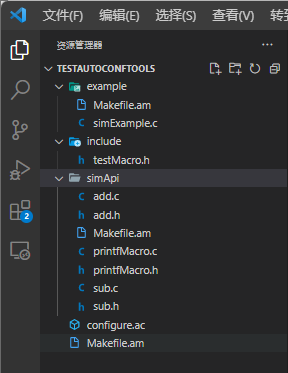

simApi目标是为了生成一个库

example的目标是调用上面生成的库，生成最终的可执行文件。

# 文件解释

​	make命令会在当前目录下去找要给Makefile的文件，找到之后会把文件中的第一个目标文件作为最终目标文件，

# make流程

## 环境安装

sudo apt-get install autoconf

sudo apt-get install libtool

## 构建项目流程

1. 在项目下（文件的生成位置取决于执行命令的目录）执行autoscan 去扫描工作区，生成configure.scan文件。scan文件只是一个模板文件，需要填的参数都已经标注，此外还需要根据实际情况添加。

2. .scan重命名成configure.ac，对configure.ac文件做一些修改。（因为生成的configure.scan是一个模板，里面是空的，需要填上相关信息，把名字改成.ac）

3. 执行aclocal，扫描configure.ac文件生成aclocal.m4文件，主要是将宏定义集中定义到aclocal.m4中。

4. autoconf命令，将configure.ac中的宏展开生成configure脚本。

5. 执行命令autoheader,生成config.h.in：这个文件中存放的用户附加的符号定义。

   __*第二条到第五条可以集成在一条指令  autoreconf --install   来完成。*__（如果不成功就要分步走排查问题）

   在新建一个项目之后，执行./configure是需要有configure文件的，如果没有可以使用autoreconf -vfi自动更新。

   执行之后结果：

   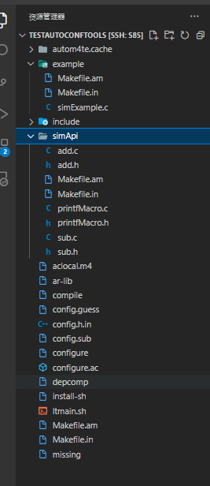

   autom4te.cache文件夹很明显是中间文件的文件夹。

   example下生成了   .in  文件。

   include没有变化。

   simApi下文件夹也生成了   .in文件。

   *根目录下：* 

   ​	多出了.in文件。

   ​	多出了第三步输出的.m4文件。

   ​	多出了第四步的configure脚本。

   ​	多出了第五步的configure.in文件。

6. 自己创建Makefile.am文件，修改配置内容。

7. 执行automake --add-missing命令，生成Makefile.in文件。

   _ *第六步到第七步不需要执行。* _

8. configure命令，   ./configure----------------------------------prefix参数要看一下

   configure是一个可执行脚本，它的选项很多，prefix参数要关注，因为在执行脚本安装的时候，就是系统默认的，需要使用prefix参数来指定安装的位置，避免后面默认系统位置安装造成的混乱，而且可以在后续删除时删除安装文件夹目录即可。

   主要是把Makefile.in文件变成最终的Makefile文件。

   ````linux
   ./configure --prefix=/home/wangdong/workspace/MakeInstallTest/
   
   ````

   安装之后  bin文件里放的可执行文件，lib里放库文件等等。

   需要指定绝对路径和文件夹必须已经存在

   ··································································直接安装在项目里面······························································

   执行部分结果：

   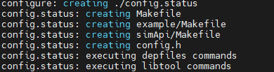

   创造出来了Makefile文件，和config.h文件。	

9. 运行make和make install     

   ````linux
   make && make install
   ````
   
   configure只是指定了路径，生成三个文件是make install命令之后。

## 实例

### 创建文件

​	不给出demo文件，这个项目test下面就只有out文件夹、configure.sh configure.ac   Makefile.am三个文件。

#### configure.sh

````
#!/bin/bash
./configure \
	--host=arm-oe-linux-gnueabi \
	--prefix=/mnt/sdb1/wangdong/workspace/apq8009-le-2-1/test/out

````

```
prefix  指定安装目录
host 	指定目标系统的体系结构，最关键的是他指定编译器的名称，因为指定了编译器的路径，也知道编译器是gcc或者g++ ，但是不知道编译器的全名，就是通过host参数来确定编译器的全名。   名字格式：host-gcc的形式。如果没有host参数，或者设置不对，就可能导致找不到交叉编译工具链。
```

#### configure.ac

````
#                                               -*- Autoconf -*-
# Process this file with autoconf to produce a configure script.

AC_PREREQ([2.69])
AC_INIT([hello-test], [1.0])
AC_CONFIG_SRCDIR([hello.c])
AC_CONFIG_HEADERS([config.h])

# Initialize Automake
AM_INIT_AUTOMAKE([-Wall foreign])
CC="/mnt/sdb1/wangdong/workspace/apq8009-le-2-1/apps_proc/build-qti-distro-fullstack-debug/tmp-glibc/deploy/sdk/toolchain/sysroots/x86_64-oesdk-linux/usr/bin/arm-oe-linux-gnueabi/arm-oe-linux-gnueabi-gcc"
# Checks for programs.
CFLAGS="--sysroot=/mnt/sdb1/wangdong/workspace/apq8009-le-2-1/apps_proc/build-qti-distro-fullstack-debug/tmp-glibc/deploy/sdk/toolchain/sysroots/armv7ahf-neon-oe-linux-gnueabi -mfpu=neon -mfloat-abi=hard"

AC_PROG_CC([$CC])

# Checks for libraries.
#LDFLAGS="-L/mnt/sdb1/wangdong/workspace/apq8009-le-2-1/apps_proc/build-qti-distro-fullstack-debug/tmp-glibc/deploy/sdk/toolchain/sysroots/armv7ahf-neon-oe-linux-gnueabi/usr/lib"


# Checks for header files.
#CPPFLAGS="-I/mnt/sdb1/wangdong/workspace/apq8009-le-2-1/apps_proc/build-qti-distro-fullstack-debug/tmp-glibc/deploy/sdk/toolchain/sysroots/armv7ahf-neon-oe-linux-gnueabi/usr/include"

# Checks for typedefs, structures, and compiler characteristics.

# Checks for library functions.

# Generate Makefile
AC_CONFIG_FILES([Makefile])

# Output
AC_OUTPUT

````

重要参数解释：

```
CC   指定编译器路径
CFLAGS指定参数 ，host   prefix这些参数是没有办法写在这里，只能用脚本传递
AC_PROG_CC([$CC])    传递CC参数
```

#### Makefile.am

````
AM_CFLAGS = -Wall \
    -Wundef \
    -Wno-trigraphs \
    -g -O0 \
    -Dstrlcpy=g_strlcpy \
    -Dstrlcat=g_strlcat


AM_CXXFLAGS = \
    $(AM_CFLAGS) \
    -fpermissive

ACLOCAL_AMFLAGS = -I m4

AM_CPPFLAGS = -D__packed__=

SRCS = \
        hello.c


bin_PROGRAMS = hello_test
hello_test_CC = $(CC)


hello_test_SOURCES = $(SRCS)

hello_test_CFLAGS =  $(AM_CFLAGS)
hello_test_CPPFLAGS = $(AM_CPPFLAGS)

hello_test_LDADD = -lm

````

### 编译流程

1. 执行autoscan 去扫描工作区，生成configure.scan文件，更名为configure.ac（==如果自己手动创建configure.ac文件就不需要执行这步==）使用生成的.scan模板能更方便的写.ac文件。

2. 构建运行环境执行autoreconf -vfi     生成执行第2步的./configure需要的configure文件。

3. 执行configure.sh脚本

4. 执行make

5. 执行make install


会发现这个流程和前面的构建项目流程说的不一样。这是因为前面的构建项目流程更加详细，更适合学习和调试。

本质上是一样的。

autoreconf执行了aclocal   autoconf   autoheader三条命令。这个命令最主要的是生成了configure文件，后面要执行./configure

执行configure.sh本质就是执行./configure只是将这些参数写在脚本里，减少人工输入 的失误。

最后就是make和make install

# configure.ac中各种宏的说法：

AC_PREREQ() 宏指定autoconf的最低版本。

AC_INIT() 初始化autoconf系统。

AM_INIT_AUTOMAKE是automake的宏，初始化automake，与编译器没有关系。

AC_CONFIG_SRCDIR 宏的目的是为了让configure脚本知道，它执行的目录是否真的是工程的目录。

AC_CONFIG_HEADER([config.h])生成configure.h文件。

AC_PROG_CC宏决定了使用哪一个c编译器。如果指定了参数则按照指定参数的顺序检查编译器是否可用。

AC_CONFIG_FILE宏将模板文件实例化，输出文件。

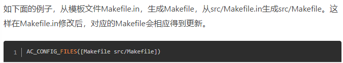

AC_SUBST([QMI_LIBS]) 会把变量向下一级传递，AC_CONFIG_FILES([Makefile])这个里面的文件都是应该可以接收到的。

## 各种检测宏概述

````
AM_PROG_LIBTOOL: 检查是否安装了 libtool，并设置 LIBTOOL 变量。

AC_PROG_CC: 检查 C 编译器是否可用，并设置 CC 变量。

AM_PROG_CC_C_O: 检查编译器是否支持 -c 选项，并设置 CFLAGS 变量。

AC_PROG_LIBTOOL: 检查 libtool 是否可用，并设置 LIBTOOL 变量。

AC_PROG_AWK: 检查 awk 是否可用，并设置 AWK 变量。

AC_PROG_CPP: 检查 C 预处理器是否可用，并设置 CPP 变量。

AC_PROG_CXX: 检查 C++ 编译器是否可用，并设置 CXX 变量。

AC_PROG_INSTALL: 检查 install 命令是否可用，并设置 INSTALL 变量。

AC_PROG_LN_S: 检查 ln 命令是否支持 -s 选项，并设置 LN_S 变量。

AC_PROG_MAKE_SET: 检查 make 命令是否支持 -e 选项，并设置 MAKEFLAGS 变量。

PKG_PROG_PKG_CONFIG: 检查 pkg-config 是否可用，并设置 PKG_CONFIG 变量。
````


````
AC_HEADER_STDBOOL 宏用于检查编译环境是否支持标准的布尔类型（stdbool.h 头文件和 bool 类型）。

AC_TYPE_OFF_T 宏用于检查编译环境是否定义了 off_t 类型，该类型通常用于文件偏移量。

AC_TYPE_SIZE_T 宏用于检查编译环境是否定义了 size_t 类型，该类型通常用于表示对象的大小。

AC_TYPE_UINT32_T 宏用于检查编译环境是否定义了无符号 32 位整数类型 uint32_t。

AC_TYPE_UINT8_T 宏用于检查编译环境是否定义了无符号 8 位整数类型 uint8_t
````


## AC_ARG_WITH

**AC_ARG_WITH(modulename,description,unconditionaltest,conditionaltest)**

这个宏是很重要的，ac文件中很大一部分内容都是在使用这个宏进行判断一些依赖，进而确保整个依赖环境的正常。

==主要的目的是指定一些头文件和库文件路径==

### if test


在ac文件中为了这个项目适应不同的平台目标，常常采用if test的方式来判断平台，来决定makefile中加载什么样的宏定义等。

````
if test "x$TARGET" = "xqrbx210"; then
    echo "\n UL qrbx210 enabled\n"
    CPPFLAGS="${CPPFLAGS} -DFEATURE_IPACM_UL_FIREWALL -DFEATURE_IPACM_PER_CLIENT_STATS -DFEATURE_VLAN_MPDN"
    CFLAGS="${CFLAGS} -DFEATURE_IPACM_UL_FIREWALL -DFEATURE_IPACM_PER_CLIENT_STATS -DFEATURE_VLAN_MPDN"
fi
````

需要注意的是TARGET如果是一个陌生的目标，需要去查看configure的log文件，里面会有这个参数的。

test的格式是参数前面还要加上x   所以是xqrbx210


==if test一般都是用在AC_ARG_WITH的语句后面==

````
AC_ARG_WITH([hardware_include],
                  AC_HELP_STRING([--with-hardware-include=@<:@dir@:>@],
                                 [Specify the location of the hardware headers]),
                                 [hardware_incdir=$withval],
                                 with_hardware_include=no)

if test "x$with_hardware_include" != "xno"; then
       CPPFLAGS="${CPPFLAGS} -I${hardware_incdir}"
fi
AC_SUBST([CFLAGS])
AC_SUBST([CPPFLAGS])
AC_SUBST([CC])
````

​	首先--with-hardware-include 判断是否真的有路径，确定不是空的，然后把值赋给hardware_include，然后还把路径添加到CPPFLAGS中，最后把CFLAGS、CPPFLAGS、CC参数全部传递。

### pkconfig

PKG_PROG_PKG_CONFIG  需要知道的是pkg_check_modules是Cmake自己的模块用来简化封装，安装某些库的时候，会包括一个后缀名为pc的文件，这个文件的路径就是用pkg-config的来指定的。

***为什么要使用pkgconfig呢？   这是因为库多起来之后，移植等问题也很多，在不同的版本中路径也可能不一样，使用pkgconfig就是为了减小麻烦的。pkgconfig规定了库的版本路径 名字等等一系列信息，这些信息全部都规定在一个后缀pc的文件中，这样找库的时候就不需要找库了，而是找这个pc文件，根据pc文件中提供的信息判断是否是自己要的版本，进而决定是否要采用。而pc文件的路径是使用一个参数指定的  PKG_CONFIG_PATH  这样找库就变为找一个个的pc文件***

可以使用***find查找pkgconfig文件名***来找到各个路径文件。找到之后发现里面都是各种pc文件。打开这些pc文件

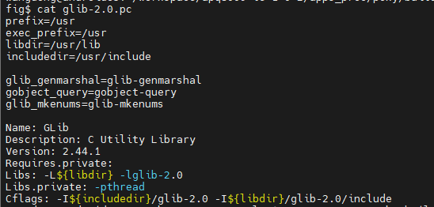

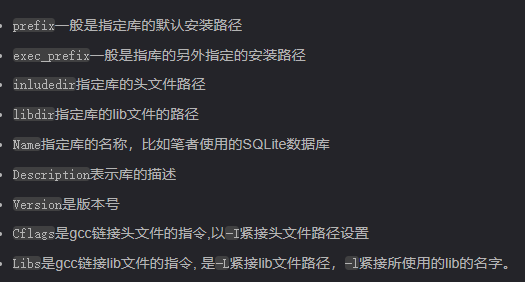

这里面指定的路径就是在同级目录下

/apq8009-le-2-1/apps_proc/build-qti-distro-fullstack-debug/tmp-glibc/work/open_q_212a_homehub-oe-linux-gnueabi/simcom-sdk/1.0-r3/recipe-sysroot/usr/lib$

usr   lib   include等都是指的recipe-sysroot下的文件目录。也可以在这里面找到这些文件。

里面的都是各种的关于库的文件，可以看见包含了check时生成的各种返回值（见下文）。

PKG_CHECK_MODULES([QMI], [qmi])   检查给定的模块，这个意思就是我们去找一个qmi的库，找到了就生成一些东西。它的返回值也是很重要的：最简单的用法就是判断库版本信息。

***PKGCONFIG*** 的具体使用方法要看后面和参数传递一起使用。


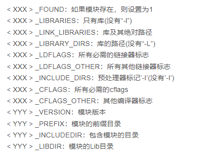

### AM_CONDITIONAL

AM_CONDITIONAL(USE_GLIB, test "x${with_glib}" = "xyes")这条语句会将，后面test的结果返回给前面，这样就起到了条件赋值的作用。解决了依赖性的问题。

因为如果with_glib是yes那USE_GLIB也是yes       

这句判断语句一般都是在ac文件中，那如何去判断with_glib是否开启？？？

====

### AC_OUTPUT

AC_OUTPUT宏产生config.status并且执行它。config.status负责产生Makefile和其他文件。

# Makefile.am

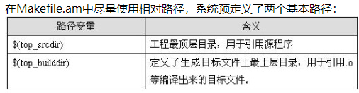

## 编译器相关参数

CFLAGS   表示c编译器选项

后缀中经常采用相对路径的方法，这个./ 表示当前目录下去寻找，当前目录指的就是makefile文件所在的目录。

​	-Wall    以最高级别使用GNU编译程序，专门用来显示警告信息的。允许发出gcc提供的所有有用的报警信息   


CPPFLAGS 表示c预处理器

CXXFLAGS   表示c++编译器选项

## 库相关参数

LDFLAGS     表示gcc编译器会用到的一些优化参数，也可以在这个里面指定库文件位置。

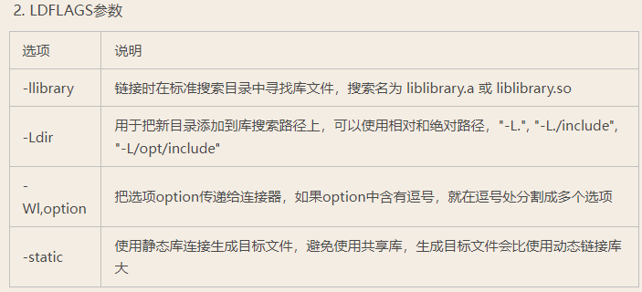

LIBS     告诉链接器需要链接哪些文件

LIBADD  对库使用

LDADD  对可执行文件或者程序使用

==LIBADD和LDADD的区别==：LIBADD用于将内容添加到库中，LDADD用于将内容添加到可执行文件中。

总结LDFLAGS告诉去哪找库文件，LIBS告诉需要链接哪些库文件


实例解析（这个实例就是为了生成一个client的可执行文件）：

```
# 直接指明要生成可执行文件，并且安装时是会被安装到系统里面的
# 如果只是想生成，不想装到系统里把bin换成noinst
bin_PROGRAMS = client
# 这个是指定了生成client的源文件，（为什么是client是因为前面那句指明了生成的二进制文件是client，也就是说这就要写在上一句后面，而且名字由上一句决定）
client_SOURCES = key.c connect.c client.c main.c session.c hash.c
# c语言预处理器参数
client_CPPFLAGS = -DCONFIG_DIR=\"$(sysconfdir)\" 
DLIBRARY_DIR=\"$(pkglibdir)\"
client_LDFLAGS = -export-dynamic -lmemcached
noinst_HEADERS = client.h
INCLUDES = -I/usr/local/libmemcached/include/
client_LDADD = $(top_builddir)/sx/libsession.la \
            $(top_builddir)/util/libutil.la
```

!!!***bin_PROGRAMS = client其实是一种通用的格式，PROGRAMS表示这句是生成可执行文件的可执行文件放在bin，目标文件是client； client_SOURCES= ....   SOURCES表示的就是这句是指定源文件的，指定的是client的源文件，源文件是...等等等。以此类推都是这样。**

**AC_SUBST**输出一个变量到由configure生成的文件中。具体内容将在后面说明。


**AC_OUTPUT**列出由configure脚本创建的文件。这些文件都是由带.in后缀的同名文件生成的。例如，src/Makefile是由src/Makefile.in生成的，config.h是由config.h.in生成的。在执行AC_OUTPUT宏时，configure脚本处理包含有两个@符号标志的变量(例如@PACKAGE@)的文件。只有用AC_SUBST输出了变量，它才能识别这些变量(许多在上面讨论过的预先写好的宏都用AC_SUBST定义变量)。这些特征用于将一个Makefile.in文件转换成一个Makefile文件。典型情况下，Makefile.in 是由automake从Makefile.am（了解更多Makefile.am的写法请阅读《[Makefile.am 规则和实例详解](https://link.jianshu.com?t=http://www.ivpeng.com/pblog/makefile-am.html)》）生成的(不过，你可以只用autoconf，而不用automake，自己编写一个 Makefile.in)。

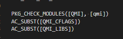

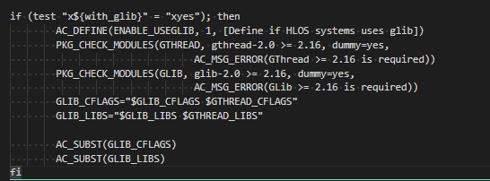

AC_SUBST经常和pkgcheck配合使用。第一种是因为qmi的库已经有了，只需要使用pkg去检查就可以了，接着将qmi的cflags和libs传下去。方面在.am文件中使用。

但是后面的glib就不一定了，需要进行一系列更复杂的判断，拿到它的cflags和libs之后传递下去。

需要注意的是无论是传递的CFLAGS还是LIBS参数，这两个都是pkgconfig的参数，CFLAGS是负责编译时使用的，LIBS是链接的时候使用的。

## GCC总体选项表

.am文件是可以用gcc的语法

-I dir   表示在头文件的搜索路径列表中添加dir目录

-L dir  在库文件的搜索路径中添加dir目录（大写的L是去找目录的，但是小写的l是去指定链接库的名字的）

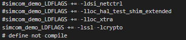

这些就是去链接的库文件。

***所以大小写的L一般都是成对出现的***

-O 指定优化等级       -O和-01指定一级优化

-o  允许用户指定输出文件的名字

-c   编译产生对象文件但是不连接成可执行文件（一般都是编译几个不相关的然后一起链接）

02  03 分别指定2  3级优化    00指定不优化


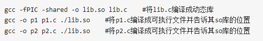

-D一般就是定义某些宏定义这些宏定义可能就是c文件开头用来选择是否添加一些include的等。这个在makefile中定义的宏一般就是在c文件中通过ifdef判断，进而决定文件的内容选择。

**-D是很常见的，因为可以使用-D定义代码中的宏，去决定代码中的部分代码是否要执行。还可以    -Dstrlcat=g_strlcat 这种方式，猜测是函数替换**

## makefile选择

​	在makefile中也是有很多选择的情况的。


## 一些环境宏

 这部分宏是系统定义好的，比如$(top_builddir)就不是用户能定义的，这个就是表示生成目标文件的最上层的目录。

$(top_srcdir)  表示工程的最顶级的目录，这也是第一个Makefile的入口所在。

## 文件路径指定
在Makefile.am中经常需要头文件、库文件、源文件等等的路径，因为项目具有嵌套结构，所以如何准确指定文件位置？
首先不要用 ./ 表示当前Makefile.am位置的路径，这是完全失效的。

使用绝对路径（项目根目录的configure.ac路径开始计算）
我的这个Makefile.am在test下面，但是用test下面的inc下的头文件，还是需要从根目录开始的路径。
```
./test/inc/hello.h
```


使用绝对路径
{srcdir}就表示当前这个Makefile.am的路径，所以后面只需要更相对路径即可
```
${srcdir}/src/hello.c
```


## 不同编译阶段变量的使用


LDADD 这个是在链接阶段需要的，原则是需要指定的，但是因为gcc本身功能很强大，这些就算不指定，也会有隐性依赖，但是对于g++来说，没有这个就会失败，显示未定义的函数。
```
test_demo_LDADD   = -ldl -lion
```


## pkgconfig

### library_includedir

### library_include_HEADERS

````
library_includedir = $(pkgincludedir)
library_include_HEADERS = $(h_sources)
````

`library_includedir`和`library_include_HEADERS`是两个变量，用于指定库的头文件路径和要安装的头文件列表。

1. `library_includedir`变量指定库的头文件所在的目录路径。它通常用于编译和链接其他项目时指定库的头文件路径，以确保编译器能够找到库的头文件。这个变量的值可以是具体的目录路径，也可以是其他变量的引用，如`$(pkgincludedir)`。
2. `library_include_HEADERS`变量指定要安装到`${includedir}`目录下的头文件列表。它通常用于在库的安装过程中将头文件复制到`${includedir}`目录，以便其他项目可以包含这些头文件来访问库的功能。这个变量的值可以是头文件列表，包括具体的头文件名称或路径。

综上所述，`library_includedir`用于指定库的头文件路径，在编译和链接其他项目时使用；而`library_include_HEADERS`用于指定要安装的头文件列表，在库的安装过程中使用。这两个变量的使用目的和作用略有不同，但都与库的头文件相关。

----

安装的位置就在usr/include下面


## 打印log

想要在Makefile.am中打印log需要专门的函数。

````
# 打印日志信息
$(info This is a log message.)

# 定义一个变量
LOG_MESSAGE := Hello, world!

# 打印变量值
$(info $(LOG_MESSAGE))

````

这个打印的过程是在make阶段完成的，对应到yocto的autotools工具，就是在编译阶段完成的，打印的log是在控制台，但是yocto本身是把log放在temp中，可以直接查看log文件。

# 库的创建和引用

​	当配方 SRC_DIR指定代码之后，执行配方回去这个路径找makefile相关文件，但是正常来说不会去这个文件的子目录找，如果这个下面有很多makefile，就需要传递啦！

需要关注两个地方am文件和ac文件（如果使用autotool）

ac文件：

```
# 这个指定所有的makefile否则一个makefile都不会去找
AC_CONFIG_FILES([
                    Makefile \
                    mcm_sample/package-tracker/Makefile \
                 ])
```

==如果ac文件这里没有添加，会报进入目录马上出来没有找到all规则的错误。==

am文件：

````\
# 这个是定义出来目录的
SUBDIRS = mcm_sample/package-tracker
````

这两个缺一不可。


但是只传递makefile是不行的，因为makefile传递好了，只是把这些makefile都加入进去了，里面的内容也是要传递的，比如有一些库的路径也需要传递。


## 库操作

==！！！！！！！！！！！！！！最需要传递是库的依赖！！！==

==有的yocto版本不需要借助pkgconfig就可以调用其他配方的库，只需要配方中依赖其他配方，然后LDADD参数指定就可以。但是有的版本yocto，就必须借助pkgconfig==

### 库添加到pkgcofig(pc.in)

​	首先在Makefile.am同级目录中，准备好一个pc文件的模板pc.in文件。

​	以qmi.pc为例子：

qmi.pc.in：

````
prefix=@prefix@
exec_prefix=@exec_prefix@
libdir=@libdir@
includedir=@includedir@

Name: qmi
Description: QMI library
Version: @VERSION@
Libs: -L${libdir} -lqmi -lqmiidl -lqmiservices
Cflags: -I${includedir}/qmi
````

然后：

在Makefile.am中：

==需要至少两个Makefile.am文件，生成pc的和编译库的两个Makefile.am不能写在一个Makefile.am中，否则虽然能够编译出来这个pkgconfig的库，但是在其他配方调用的时候始终找不到这个库==

外层Makefile.am：生成pc文件

````
# 指定路径，libdir  一般指的是usr/lib/
pkgconfigdir = $(libdir)/pkgconfig
# 指定要安装的pc文件时qmi.pc
pkgconfig_DATA = testlibsdk.pc
# 指定了要分发qmi.pc 
EXTRA_DIST = $(pkgconfig_DATA)
````

（分发的意思时，获取我的软件包的时候，也会包含qmi.pc的库）

内层Makefile.am：编译库

这个很重要，关乎到未来其他配方调用这个库的时候，能不能找到这个库的头文件。
````
h_sources=$dir_include
library_includedir = $(pkgincludedir)
library_include_HEADERS = $(h_sources)
````


在configure.ac中：

````
AC_CONFIG_FILES([Makefile \
               testlibsdk.pc \
               src/Makefile \
      ])
````

能看到qmi.pc文件，这句的意思是要根据qmi.pc.in模板生成qmi.pc文件。

所以才需要模板文件。


最终编译生成的qmi.pc文件：

```
prefix=@prefix@
exec_prefix=@exec_prefix@
libdir=@libdir@
includedir=@includedir@

Name: testlibsdk
Description: testlibsdk
Version: @VERSION@
Libs: -L${libdir} -ltestlibsdk
Cflags: -I$(WORKSPACE)/test-daemons/test-demo/inc -I${includedir}
```

### libtool

==libtool是构建编译生成库，pkgconfig是管理库，所以一些库的依赖问题都是pkgconfig的==

Libtool主要用于编译和构建库。它提供了一组工具和抽象，用于处理在不同平台和操作系统上构建和管理共享库的复杂性。Libtool帮助抽象了底层编译器和链接器命令的细节，确保库被正确地构建和链接。

在使用Libtool时，可以使用`libtool`命令将源文件编译为目标文件，将目标文件链接为共享库或静态归档文件，并安装生成的库。

另一方面，pkg-config是用于管理库的工具。它提供了一种标准化的方式来查询已安装库的编译和链接标志，以及其他信息，例如版本号和库的头文件路径。pkg-config简化了指定依赖项和构建标志以编译和链接特定库的过程。

使用pkg-config，可以使用`pkg-config`命令检索特定库所需的编译和链接标志，然后将这些标志纳入构建系统或编译命令中。

总结起来，Libtool主要关注库的编译和构建，而pkg-config关注管理库，通过提供必要的信息和标志来帮助编译和链接库。


## 调用其他配方的库（pkgconfig）

​	在yocto中，pkgconfig去管理库是最方便的，他方便安装，配置，更方便依赖（==最有用==）

### 配方

传递其他recipes进来，就是依赖别的recipes。

这个依赖一般也是会在bb文件中的依赖项中写明。

​	DEPENDS参数一定要指定需要使用库的编译配方。

但是还要在makefile中说明：

### ac文件


需要注意库名称不要后缀了，本来库名称libbtcore.la（TESTLIBSDK这个是随便取的别称，一般都是大写，这个别称不能有小数点）

````
PKG_CHECK_MODULES([TESTLIBSDK], [testlibsdk])
AC_SUBST([TESTLIBSDK_CFLAGS])
AC_SUBST([TESTLIBSDK_LIBS])
````

这个操作至关重要：

==因为这个涉及到其他配方的编译出来的库的信息是否能够导入过来==

TESTLIBSDK_CFLAGS这个是很重要的，会传递testlibsdk编译出来库的一些信息，主要是一些头文件路径、包括依赖的一些其他库等。尤其是头文件路径，==这个路径是在你当前配方下的recipe-sysroot==，他是会自动的去调整的，而不需要你去繁琐的手动调整。

放到recipe-sysroot下并且能够通过XX_CFLAGS轻松找到是非常妙的，头文件路径不是定死的，哪个配方依赖这个库，就会将头文件copy到这个配方的recipe-sysroot文件夹下，并且用XX_CFLAGS指出位置，在使用的时候直接使用XX_CFLAGS即可。

==也正因如此，你的源代码甚至不需要单独的去放这个库相关的头文件，他会在这里指定这个库的头文件，以及这个库依赖的一些其他的头文件==


比如下面就是一个库的CFLAGS的值：他指出了很多头文件路径。这是一个gstreamer配方的库，但是可以看到里面也有glib的和glib2.0

````
-pthread -I/home/wangdong/workspace/QRB2210_LE10_AP/apps_proc/build-qti-distro-fullstack-debug/tmp-glibc/work/aarch64-oe-linux/gst-play/1.0-r0/recipe-sysroot/usr/include/gstreamer-1.0 -I/home/wangdong/workspace/QRB2210_LE10_AP/apps_proc/build-qti-distro-fullstack-debug/tmp-glibc/work/aarch64-oe-linux/gst-play/1.0-r0/recipe-sysroot/usr/include/glib-2.0 -I/home/wangdong/workspace/QRB2210_LE10_AP/apps_proc/build-qti-distro-fullstack-debug/tmp-glibc/work/a    arch64-oe-linux/gst-play/1.0-r0/recipe-sysroot/usr/lib/glib-2.0/include
````


----

当做完上面这些，发现还是没有办法引用，那就需要考虑，被依赖的库是否加入到了pkgconfig管理中。

​	通过查看编译库的配方中的pkgconfig文件夹，看有没有对应pc文件。如果没有就需要添加进去。

​	添加请参考   库添加到pkgcofig   章节。

### am文件

````
# 一般是传递文件路径参数进来
AM_CFLAGS =   $(TESTLIBSDK_CFLAGS) \
    		 $(TESTLIBSDK_LIBS) \
        	
# 指明引用，上面只是传路径，用不用取决于这里        	
test_demo_LDFLAGS =  -ltestlibsdk $(TESTLIBSDK_CFLAGS) $(TESTLIBSDK_LIBS)


````


如果要用库这个是必须的：

这个库的名字是libbtcore.la但是写在这里就是简写。

```
test_demo_LDADD =-ltestlibsdk
```

## 第三方

这个就是传递一些三方的东西，这些传递起来相对麻烦，因为这些是不被yocto识别的，一般都是一些三方的库，或者是一些重要的文件（xml等一些配置文件）。

主要介绍三方库：

设置方法和上面传递配方差不多（命令不一样）。不同的是，如果引入三方库一般不需要对ac文件做出调整，一般需要在am文件中指明路径和引用即可（动态库和静态库的调用方法命令是不一样的）

PS：用库是不需要头文件的，但是没有头文件，编译链接都过不了。

​		引入的静态库是一定要把库加载到系统中去，那动态库呢？如果是生成二进制文件是不是只要把二进制文件加载到系统中去，不需要把动态库加载到系统中去？


如果是xml等配置文件，直接在install task中操作即可。


# recipes与autotool传递参数

## 传递正常参数

recipes：

```
EXTRA_OECONF = "--with-lib-path=${STAGING_LIBDIR} \
                --with-common-includes=${STAGING_INCDIR} \
                --with-glib \
                --with-sanitized-headers=${STAGING_KERNEL_BUILDDIR}/usr/include \
                --with-stderr \
                --enable-target=${BASEMACHINE}"
```

configure.ac:

````
AC_ARG_WITH([stderr],
      AC_HELP_STRING([--with-stderr=@<:@dir@:>@],
         [Enable stderr logging]),
      [],
      with_stderr=no)

if test "x$with_stderr" != "xno"; then
   CPPFLAGS="${CPPFLAGS} -DFEATURE_DATA_LOG_STDERR"
fi
````

这样就可以完成宏FEATURE_DATA_LOG_STDERR的打开。

---

如何去确认宏真的打开了？

1.在Makefile.am中打印变量查看$(info $(CPPFLAGS))

2.在工作目录，会有config.status文件生成，也能找到关于这个宏是否被真的打开。


# 遇到问题

## make[2]: *** No rule to make target 'all'.  Stop.

​	背景：我找到一个源代码，他有makefile.am文件，我想要把这个加入的编译中，我直接指定这个makefile.am所在的目录。

​	但是出现了问题，进入这个目录找到这个am文件，直接发现没有规则就退出了，除此之外，没有任何的log。

==问题是因为，我添加路径的时候，只是在上层的Makefile.am中指定了路径，没有在configure.ac中指定子Makefile.am的路径，哪怕子Makefile.am没有对应的configure.ac也要指定。==


