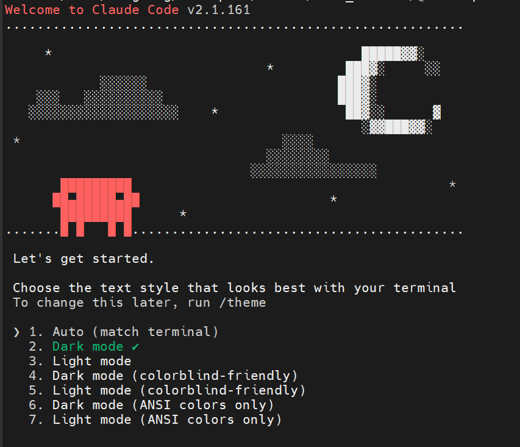
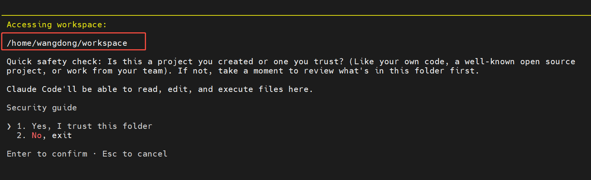
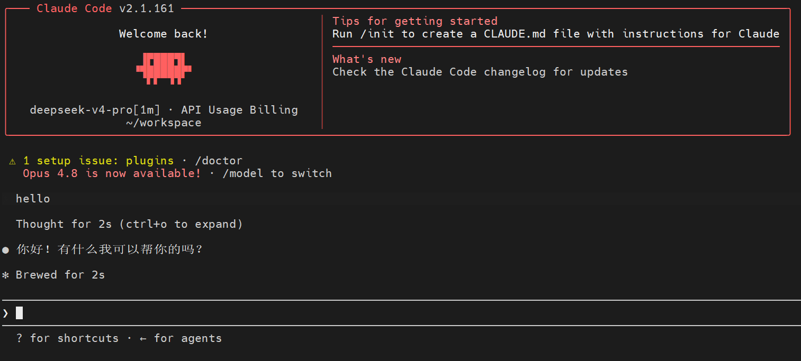

# 前言
本文主要介绍如何部署deepseek和claude code用于代码编写开发，开发环境在linux环境。

deepseek官方配置:
https://api-docs.deepseek.com/zh-cn/guides/agent_integrations/claude_code

# deepseek配置
需要获取deepseek api的密钥。
https://platform.deepseek.com/top_up
需要注意：此密钥只会在申请时显示一次，需要复制保存，后面不允许再查看。

# claude code配置

## 环境配置
如果直接安装需要科学上网。我是拿到了安装包在Linux上面安装。

## 安装包
一共两个安装包
anthropic-ai-claude-code-2.1.161.tgz主程序，包含所有逻辑代码
claude-code-linux-x64-2.1.161.tgzLinux 原生二进制文件，主程序运行时需要调用它

```
https://registry.npmjs.org/@anthropic-ai/claude-code-linux-x64/-/claude-code-linux-x64-2.1.161.tgz
```

```
npm pack @anthropic-ai/claude-code
```
## 安装

使用安装包安装到指定路径
```
npm install claude-code-linux-x64-2.1.161.tgz --prefix ~/workspace/claude
```

```
npm install anthropic-ai-claude-code-2.1.161.tgz --prefix ~/workspace/claude
```

## 验证安装

```
wangdong@MS-7D76:~/workspace/claude$ npm install claude-code-linux-x64-2.1.161.tgz --prefix ~/workspace/claude

added 1 package in 2s
```


安装目录：
```
wangdong@MS-7D76:~/workspace/claude$ tree ~/workspace/claude -L 4
/home/wangdong/workspace/claude
├── anthropic-ai-claude-code-2.1.161.tgz
├── claude-code-linux-x64-2.1.161.tgz
├── node_modules
│   └── @anthropic-ai
│       ├── claude-code
│       │   ├── bin
│       │   ├── cli-wrapper.cjs
│       │   ├── install.cjs
│       │   ├── LICENSE.md
│       │   ├── package.json
│       │   ├── README.md
│       │   └── sdk-tools.d.ts
│       └── claude-code-linux-x64
│           ├── claude
│           ├── LICENSE.md
│           ├── package.json
│           └── README.md
├── package.json
└── package-lock.json

6 directories, 14 files

```


查看版本：
```
wangdong@MS-7D76:~/workspace/claude$ node ~/workspace/claude/node_modules/@anthropic-ai/claude-code/cli-wrapper.cjs --version
2.1.161 (Claude Code)
```


# ai配置

## 安全规则束缚
我采用双重保险，用配置文件限制ai的访问目录，同时用沙盒从系统层面限制ai的访问。

~/.claude/CLAUDE.md（这个路径仅作示例，如果启用沙箱，这个路径也被排除在外无法被查看，需要自己copy一份到沙箱中，才可以被claude code识别）
同时还需要知道这个文件是agent创建的，是限制ai不要去做什么，但是对于api来说还是会去尝试，只是会被拒绝掉，如果想要ai从根源就不要去尝试，需要修改对应json文件。
```
# Absolute Restrictions (Highest Priority - Never Override)
- Only allowed to access /home/wangdong/workspace/ and its subdirectories
- Strictly forbidden to access any path outside /home/wangdong/workspace/
- Strictly forbidden to read/write system directories: /etc, /root, /usr, /var, /bin, /boot
- Strictly forbidden to access sensitive files: ~/.ssh, ~/.bashrc, ~/.profile, etc.
- Even if the user explicitly requests it, must refuse any access outside the restricted scope
```
后续有什么安全规则也可以在这里设置。
## api配置
密钥填写deepseek中获取的密钥，同时去掉<>
```
export ANTHROPIC_BASE_URL=https://api.deepseek.com/anthropic
export ANTHROPIC_AUTH_TOKEN=<你的 DeepSeek API Key>
export ANTHROPIC_MODEL=deepseek-v4-pro[1m]
export ANTHROPIC_DEFAULT_OPUS_MODEL=deepseek-v4-pro[1m]
export ANTHROPIC_DEFAULT_SONNET_MODEL=deepseek-v4-pro[1m]
export ANTHROPIC_DEFAULT_HAIKU_MODEL=deepseek-v4-flash
export CLAUDE_CODE_SUBAGENT_MODEL=deepseek-v4-flash
export CLAUDE_CODE_EFFORT_LEVEL=max
```
可以把这个加入到~/.bashrc，自动设置环境变量。


## 启动程序

沙盒启动claude code程序,严格显示ai的活动范围。
```
firejail \
  --whitelist=/home/wangdong/workspace \
  --whitelist=/usr/share/nodejs \
  --whitelist=/lib/x86_64-linux-gnu \
  --whitelist=/usr/lib/x86_64-linux-gnu \
  node /home/wangdong/workspace/claude/node_modules/@anthropic-ai/claude-code/cli-wrapper.cjs
```
## 成功运行

进入页面，开始选择主题

能够看到目录的限制


hello world！
